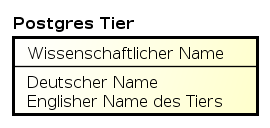
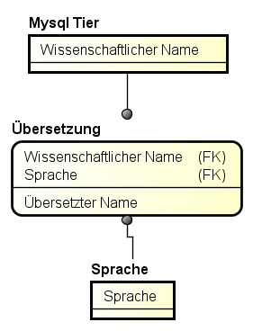

Datenbank Entwurf
=================

Die Tabellen der Datenbanken dienen zur Speicherung von Tiernamen sowie deren
Übersetzungen.

PostgreSQL
~~~~~~~~~~

In PostgreSQL werden alle Informationen in der selben Tabelle gespeichert.
Allerding müsste das Design angepasst werden wenn Übersetzungen in neue
Sprachen hinzugefügt werden sollen. Derzeit werden folgende Sprachen
unterstützt:

* Wissenschaftlicher Name (meist Latein)
* Deutscher Name
* Englischer Name

MySQL
~~~~~

